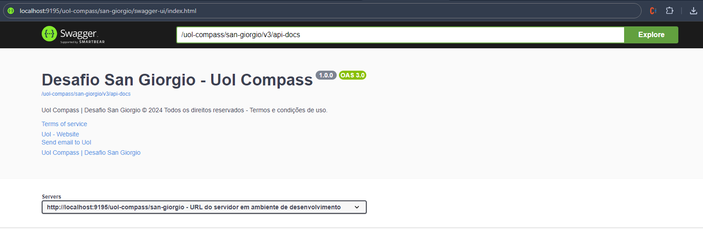
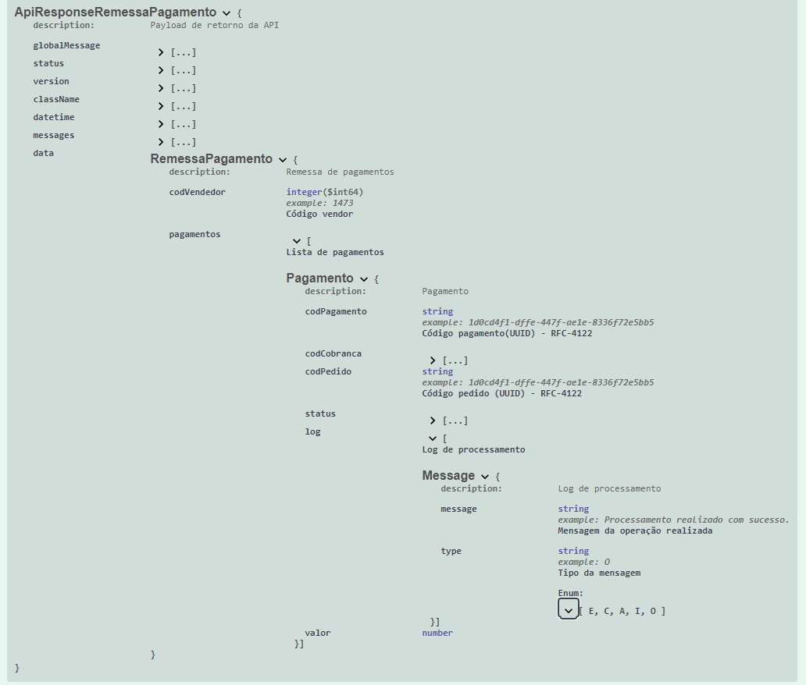
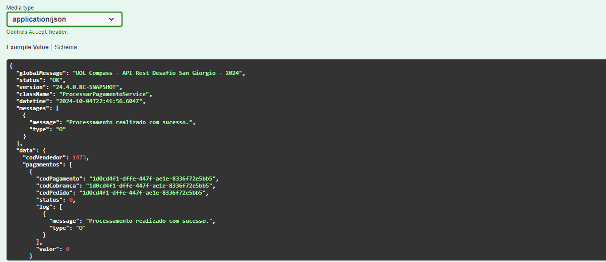
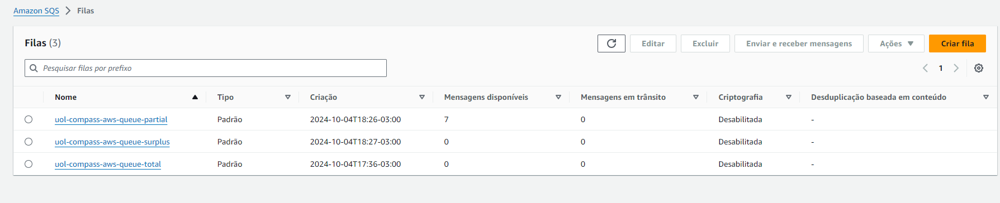
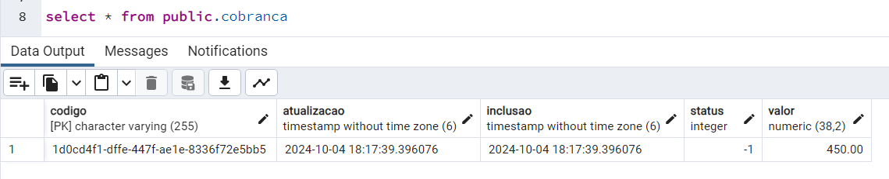
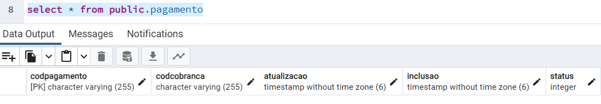
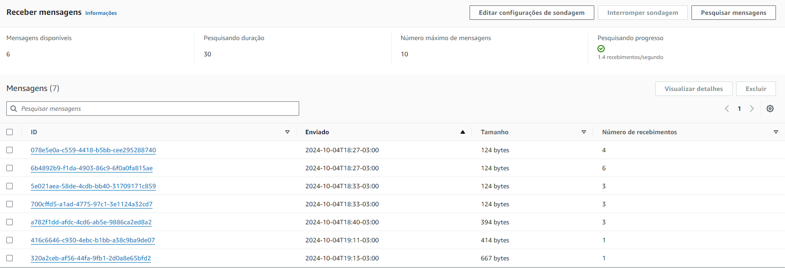
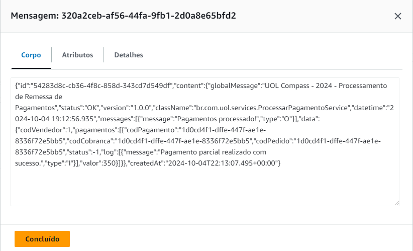
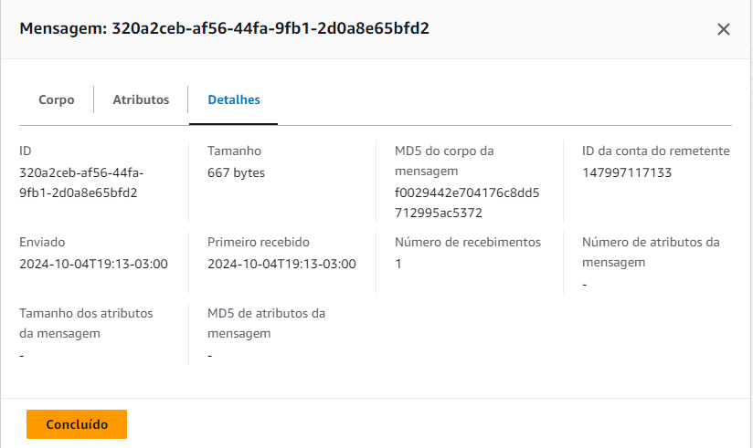

# Desafio San Giorgio - Uol Compass - 2024

Requisitos de avaliação técnica - Sadrak Silva



### 📋 Tecnologias

```
Java 21
Spring Boot 3.2.4
Amazon AWS JAVA SKD SQS 1.12.632
Springfox Swagger UI 3.0.0
Maven Compiler 3.11
Postgres 12
ORM: Hibernate
```

### 🔩 Resposta do recurso de processamento de pagamentos



### ⌨️ Payload de retorno



## 📦 Filas Amazon SQS criadas



## 📦 Modelos PostgreSQL





## 🛠️ Mensagens enviadas à AWS






---
⌨️ por [Sadrak Silva](https://github.com/Sadrak2017)
